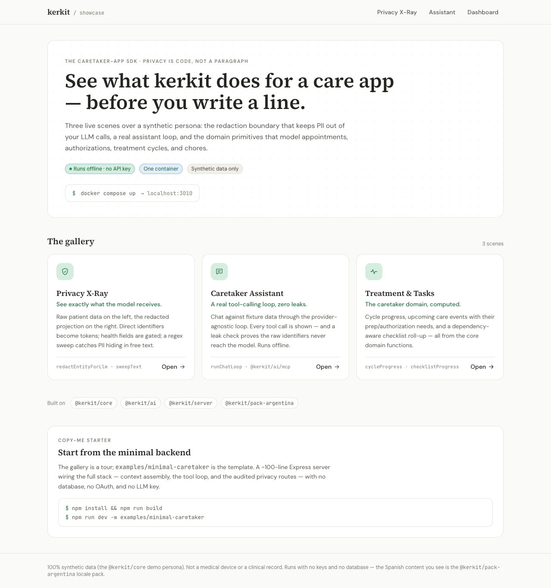
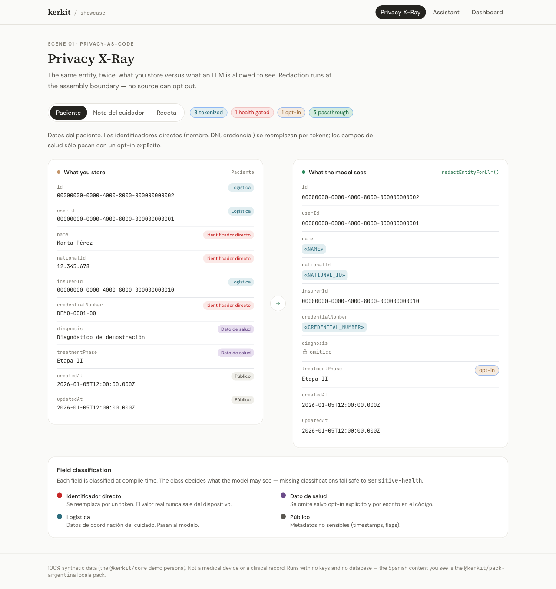
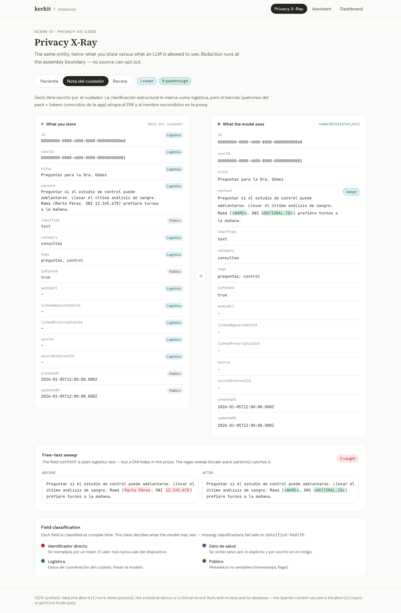
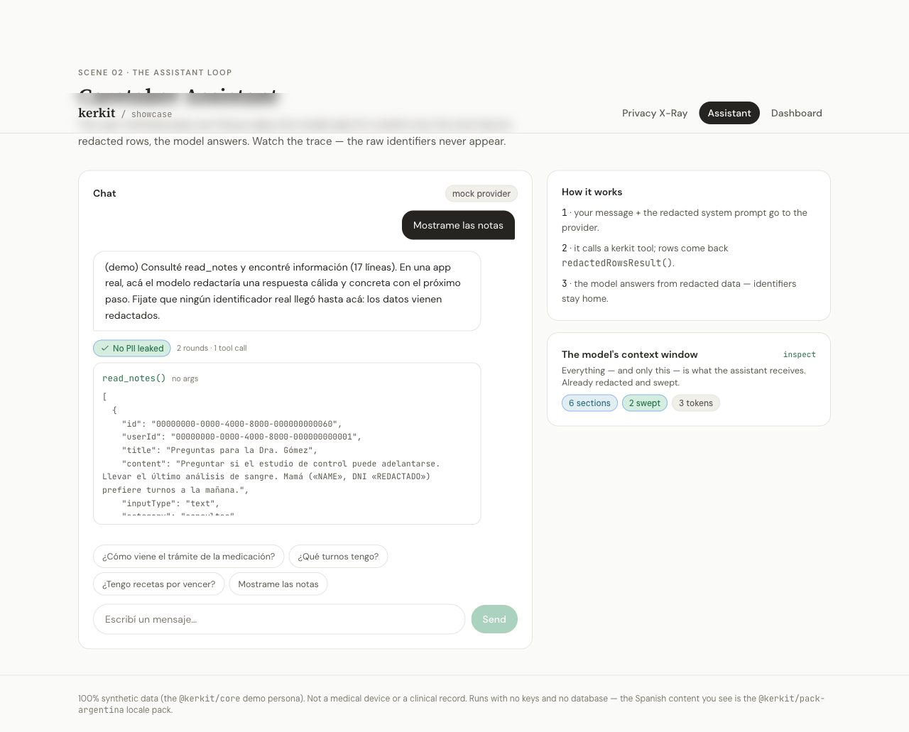
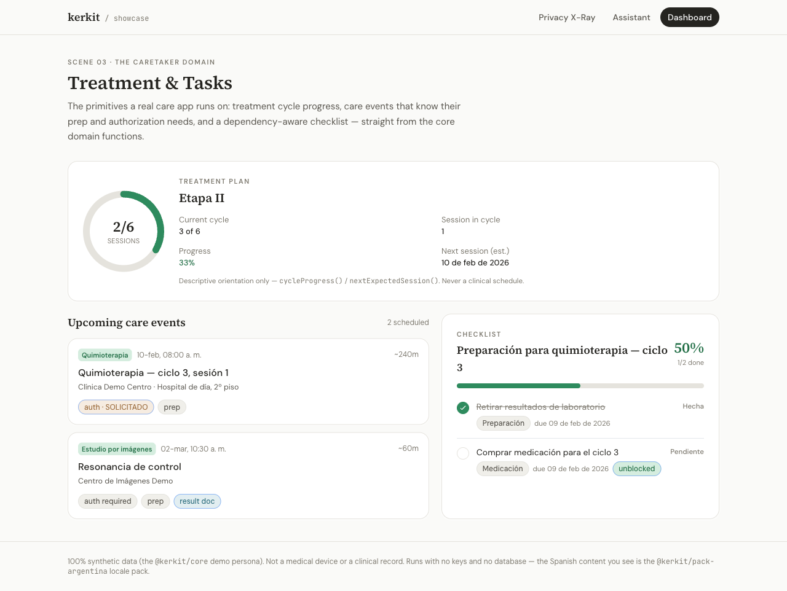

# kerkit

**Building blocks for caretaker apps.** An open-source TypeScript SDK extracted from a real app used to manage a chemotherapy patient's treatment in Argentina's obra social system.

[](https://github.com/JuanseHevia/kerkit/actions/workflows/ci.yml)
[](./LICENSE)
[](https://www.typescriptlang.org/)
[](./CONTRIBUTING.md)

> **Status: pre-1.0 — API may change between minor versions.** Not published to npm yet; use from source.

> ⚠️ **kerkit is not a medical device and does not provide medical advice.** It models caretaker-authored *logistics* data — appointments, trámites, prescriptions-as-documents, notes — not clinical records. See [NOTICE](./NOTICE).

**Try it in one command** — no clone, no database, no API key:

```bash
npx github:JuanseHevia/kerkit
```

It prints raw caretaker data next to the redacted projection the model receives, then proves the synthetic patient's DNI never reached the model. Runs in a few seconds — no install, no build.

## Table of contents

- [Quickstart](#quickstart)
- [Is this for me?](#is-this-for-me)
- [Why kerkit exists](#why-kerkit-exists)
- [See it in action](#see-it-in-action)
- [Packages](#packages)
- [Usage example](#usage-example)
- [Privacy model](#privacy-model)
- [Monorepo layout](#monorepo-layout)
- [Contributing](#contributing)
- [License](#license)

## Quickstart

See the privacy model in action in one command — no clone, no database, no API key:

```bash
npx github:JuanseHevia/kerkit
```

You should see the raw caretaker record, the redacted projection the model actually receives, and a leak check ending in `✅ PASS — no raw identifier reached the model.` Runs in a few seconds — no install, no build.

### Build on it

**Prerequisites:** Node ≥ 22, npm ≥ 11 (ships with Node 22).

```bash
git clone https://github.com/JuanseHevia/kerkit.git
cd kerkit
npm install
npm run build
npm run test
```

All 18 test suites should pass (172 tests). Then run the full demo server — no database, no OAuth, no LLM key:

```bash
cd examples/minimal-caretaker
npm run dev   # → http://localhost:3010
```

**You're in if** the server starts and these return data:

```bash
# The caretaker context window — redacted, with a transparency report
curl http://localhost:3010/context

# A real tool-calling loop (scripted model — set OPENAI_API_KEY for the live thing)
curl -X POST http://localhost:3010/chat \
  -H 'content-type: application/json' \
  -d '{"message":"¿Cómo viene el trámite de la medicación?"}'

# Data rights surface
curl http://localhost:3010/privacy/export
```

## Is this for me?

| You are… | Use |
|---|---|
| Building a caretaker app **for Argentina** (obra social, trámites, recetas) | Everything: `core` + `pack-argentina` + `ai` + `ui` + `server` |
| Building a caretaker app **elsewhere in LatAm / es** | `core` + `ai` (+ `ui`); fork `pack-argentina` as the template for your locale pack |
| Building **in English / another system** | `core` + `ai` are locale-neutral; you write the pack |
| **Curious / evaluating** | Start with the [Showcase Gallery](#see-it-in-action) (one Docker command, no setup) |

Argentina-first is a feature, not an accident: the entities, the authorization state machine, and the email-signal patterns were proven against a real treatment at a real obra social.

## Why kerkit exists

A caretaker accompanying a chemo patient carries a second job: tracking authorizations that expire, prescriptions that lapse, studies that need pre-approval, and a dozen institutional email threads. Generic AI assistants can answer questions; they don't ship the **domain model**, the **privacy discipline**, or the **calm UI conventions** this situation demands. kerkit packages those three things so you can build the app your community needs.

## See it in action

The **[Showcase Gallery](./examples/gallery)** is a visual, container-runnable tour of the SDK — three live scenes over a synthetic persona, with no database, no OAuth, and no API key:

```bash
cd examples/gallery && docker compose up   # → http://localhost:3010
```

[](./examples/gallery)

### 🛡️ Privacy X-Ray — *see exactly what the model receives*

The same entity, twice: raw data on the left, the redacted projection on the right. Direct identifiers become tokens, sensitive health fields are gated behind an explicit opt-in, and a regex sweep catches PII hiding in free text.

<p align="center">
  
  
</p>

### 💬 Caretaker Assistant — *a real tool-calling loop, zero leaks*

The provider-agnostic `runChatLoop` over fixture data, with a visible tool-call trace and a leak check that proves the raw identifiers never reach the model.



### 📊 Treatment & Tasks — *the caretaker domain, computed*

Treatment cycle progress, upcoming care events that know their prep and authorization needs, and a dependency-aware checklist roll-up — straight from the core domain functions.



## Packages

| Package | Purpose | Install (npm, coming soon) |
|---|---|---|
| [`@kerkit/core`](./packages/core) | Entities, Zod schemas, authorization state machine, care-event taxonomy, privacy primitives, repository interfaces, synthetic fixtures | `npm i @kerkit/core`¹ |
| [`@kerkit/pack-argentina`](./packages/pack-argentina) | es-AR strings (voseo), obra social model, email signal patterns, DNI/CUIL redaction rules, Ley 25.326 guidance | `npm i @kerkit/pack-argentina`¹ |
| [`@kerkit/ai`](./packages/ai) | ContextAssembler (redaction-enforced context window), provider-agnostic tool-calling loop, MCP tool toolkit, prompt conventions | `npm i @kerkit/ai`¹ |
| [`@kerkit/ui`](./packages/ui) | "Calm Confidence" design tokens; React Native components (shipping in waves) | `npm i @kerkit/ui`¹ |
| [`@kerkit/server`](./packages/server) | Drizzle schema factory, repository implementations, consent/export/delete route factories with audit, cron skeletons | `npm i @kerkit/server`¹ |

> ¹ **Not yet published to npm** — these `npm i` commands will work after the first release. Until then, consume the packages from source via the [Build on it](#quickstart) clone flow (npm workspaces are already wired up).

## Usage example

```ts
import {
  CARE_EVENT_KINDS,
  isValidTransition,
  fixtureEntities,
} from '@kerkit/core';

// Query what a care event requires — no lookup tables, just TypeScript
const { chemo } = CARE_EVENT_KINDS;
console.log(chemo.requiresAuthorization);   // true
console.log(chemo.requiresPrep);            // true
console.log(chemo.typicalDurationMinutes);  // 240

// Drive the authorization state machine
isValidTransition('needed', 'requested');   // true
isValidTransition('confirmed', 'pending');  // false — confirmed is terminal

// Canonical synthetic persona, ready for tests and demos
const { patient, appointmentChemo, authorization } = fixtureEntities;
console.log(patient.name);                  // "Marta Pérez"
console.log(authorization.status);         // "pending"
```

Extending entities (add a field without forking): see [EXTENDING.md](./EXTENDING.md).

## Privacy model

Privacy is enforced in code, not documented in a paragraph:

- Every entity field carries a **data classification** (`direct-identifier` / `sensitive-health` / `logistics` / `public`). CI fails if a field is unclassified.
- **Redaction before LLM calls.** A field classified `direct-identifier` becomes a placeholder token and its value never reaches the model — this is the *proven* structural invariant. `sensitive-health` fields pass only with an explicit per-field opt-in in your code. Use [`createRedactedChat`](./packages/ai) (or thread one `RedactionSession` through context assembly + `runChatLoop`) and the same discipline covers every LLM ingress — context, tool output, message history, tool errors — at one sink.
  - **Known limitation (honest scope):** identifiers hiding in *free text* (a name typed into a note) are caught by a best-effort sweep — regex patterns plus the session's known values. Recall is not 100% on arbitrary input, and free-text **name** redaction only applies when you thread the session (the factory does this for you). Structured `direct-identifier` fields are the guaranteed part.
- **Consent, export, and delete** are first-class primitives in `@kerkit/server`, not roadmap items.
- System prompts ship with non-removable blocks: never ask the user for identifiers or credentials; never present as medical advice.

Deep dive: [`docs/anonymization-testing-framework.md`](./docs/anonymization-testing-framework.md).

## Monorepo layout

```
kerkit/
├── packages/
│   ├── core/            # Entities, schemas, domain logic, privacy primitives
│   ├── pack-argentina/  # Argentina locale pack
│   ├── ai/              # AI context assembly + tool-calling loop
│   ├── ui/              # Design tokens + React Native components
│   └── server/          # Drizzle schema, repositories, privacy routes
├── examples/
│   ├── minimal-caretaker/  # Zero-config demo server (no DB, no OAuth, no LLM key)
│   └── gallery/            # Visual Showcase Gallery (Docker)
└── docs/
    ├── anonymization-testing-framework.md
    ├── domain-fidelity-review.md
    └── compliance/            # Argentine legal standards + evaluation framework
```

**Tooling:** npm workspaces, [Turborepo](https://turbo.build/), [Zod](https://zod.dev/), [Drizzle ORM](https://orm.drizzle.team/), [Changesets](https://github.com/changesets/changesets), [gitleaks](https://github.com/gitleaks/gitleaks) (Argentine identifier rules).

## Contributing

See [CONTRIBUTING.md](./CONTRIBUTING.md) for contribution lanes, the PII rules (all examples use the canonical synthetic persona), and how to share domain knowledge as an eval scenario — no code required.

Bug fixes with tests and Argentine insurer data rows for `@kerkit/pack-argentina` are accepted without prior discussion. Everything else: open an issue first.

## License

[Apache-2.0](./LICENSE). See [NOTICE](./NOTICE) for scope disclaimers.

> ⚠️ **Not a medical device.** kerkit models logistics data authored by caretakers. It does not provide medical advice, clinical recommendations, or dosing guidance.
